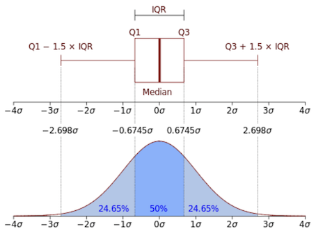
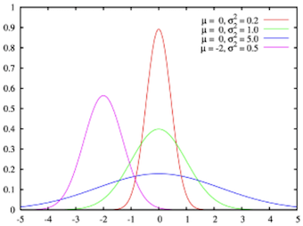
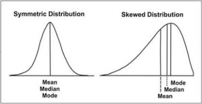
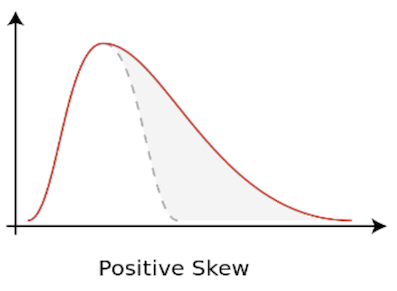
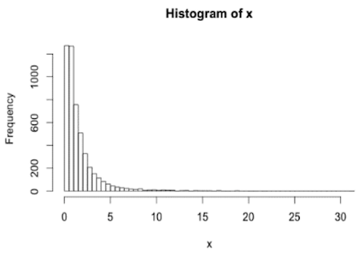
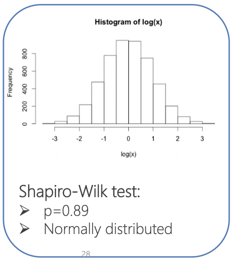

---
# Please do not edit this file directly; it is auto generated.
# Instead, please edit 00-Terminology-Review.md in _episodes_rmd/
title: "Review of Variable Terminology"
teaching: 30
exercises: 5
questions:
- "What are the different terminology variables?"
- "What are measures of central tendency and variability?"
objectives:
- "Define terminology variables"
- "Review measures of central tendency and variability"
- "Review visualisation techniques such as box plots and histograms"
keypoints:
- "Understand the terminology variables that will be referenced in this workshop"
- "Understand how to calculate measures of central tendency and variability"
- "Understand that box plots and histograms can be used to visualise data spread"
- "Understand the normal distribution and why normality tests are an important step in conducting statistical comparisons"
output: html_document
---

## Terminology Variables

Variables are the quantities measured in a sample. They may be classified as:

- Quantitative i.e., numerical

  - Continuous (e.g., age, patient cholesterol levels)

  

  - Discrete (take a finite number of values)

  

- Categorical

  - Nominal (e.g., gender, blood group)

  

  - Ordinal (ranked e.g., mild, moderate or severe illness)

  

_Note: Often ordinal variables are re-coded to be quantitative._

## Measures of Central Tendency and Variability

Numerical descriptive measures include:

- **Measures of central tendency:** Describe the center of the distribution
- **Measures of variability:** Describe how the measurements vary about the center of the distribution

### Measures of central tendency

The **mean** is the sum of measurements divided by the total number of measurements.

If the data are arranged in increasing order, the **median** is:

- The middle value if n is an odd number, or
- The midway between the two middle values if n is an even number

The **mode** is the most commonly occurring value (value with the highest frequency).

### Example: Calculating measures of central tendency

The systolic blood pressure of seven middle aged men were as follows:

151, 124, 132, 170, 146, 124 and 113

**Mean:**
$$\bar{x} = \frac{151 + 124 + 132 + 170 + 146 + 124 + 113}{7} = 137.14$$

**Median:** 113, 124, 124, **132**, 146, 151, 170

**Mode:**

| 113 | **124** | 132 | 146 | 151 | 170 |
|:---:|:-------:|:---:|:---:|:---:|:---:|
| 1   | **2**   | 1   | 1   | 1   | 1   |

### Measures of variability

Main measures of variability include:

- Range
- Variance
- Standard deviation
- Interquartile range (IQR)

The sample **range** is the difference between the largest and smallest observations in the sample.

Using blood pressure:

- Min: 113 mmHg
- Max: 170 mmHg

Range = Max - Min
      = $$170 - 113 = 57 mmHg$$

This is useful for the “best” and “worst” case scenarios.

The sample **variance**, s², is the arithmetic mean of the squared deviations from the sample mean:

$$s^2 = \frac{\sum_{i=1}^{n}(x_i - \bar{x})^2}{n-1}$$

The sample **standard deviation**, s, is the square-root of the variance.

### Example: Calculating measures of variability

Using the blood pressure data (151, 124, 132, 170, 146, 124, 113):

**Range:**
$$\text{Max} - \text{Min} = 170 - 113 = 57$$

**Mean:**
$$\bar{x} = 137.14$$

**Variance:**
$$s^2 = \frac{(151-137.14)^2 + (124-137.14)^2 + \cdots}{7-1} \approx 384.14$$

**Standard deviation:**
$$s = \sqrt{384.14} \approx 19.60$$

### Interquartile range

The Median divides a distribution into two halves. The first and third quartiles (denoted Q₁ and Q₃) are defined as follows:

- 25% of the data lie below Q₁ (and 75% is above Q₁),
- 25% of the data lie above Q₃ (and 75% is below Q₃)

The **interquartile range (IQR)** is the difference between the first and third quartiles: IQR = Q₃- Q₁.

### Example: Calculating measures of variability - interquartile range

Using the blood pressure data (151, 124, 132, 170, 146, 124, 113):

Q1 = $$N/4 = 7 / 4 = 1.75$$
Q3 = $$3 x N/4 = 21 / 4 = 5.25$$

IQR = $$148.5 - 124 = 24.5$$

## Box-Plots

A box-plot is a visual description of the distribution based on:

- Minimum
- Q1
- Median
- Q3
- Maximum

Box-plots are useful for comparing samples from several different treatments or population.

## Histograms

A histogram is used to display the distribution of quantitative data in which the values are broken in a number of bins. The histogram is obtained by drawing rectangles in which the bases are the bins intervals and the heights are the counts in each bin.

A relative frequency histogram represents the proportion of counts in each bin (total area of 1):

$$\text{height} = \frac{\text{count}}{\text{width}x\text{total number}}$$ → first one: $$\text{height} = \frac{1}{20x7} \approx 0.007$$

Histograms are usually accompanied by a Probability Density Function, which is used for calculating the probabilities for continuous random variables and represents the density of probability for a continuous random variable over the specified ranges.

## The Normal Distribution

Many variables of interest follow a normal distribution (e.g., age, height, weight, …). The normal distribution has a symmetric bell-shaped density curve, and is characterised by two parameters:

1. Mean, µ
2. Standard deviation, σ

X follows a Normal distribution with the parameters μ (mean) and σ (standard deviation): $$X \sim N(\mu, \sigma)$$

### Measures of variability: Which one to use?

| Type of variable | Best measure of central tendency | Best measure of spread |
|---|---|---|
| Interval/ratio (not skewed) | Mean | Standard deviation |
| Interval/ratio (skewed) | Median | Range or inter-quartile range |

### Tests for normality and variance equivalence

If our outcome variable is continuous and we are measuring it between two or more groups, then there are two additional tests that will need to be performed to help us identify which is the correct statistical test to test the hypothesis on.

1. **The Shapiro-Wilks’ test of Normality**
2. **The Levene’s test of Equality of Variances**

### Normal distribution: How to know?

To assess whether or not a random sample is selected from a normal distribution:

- Normal probability plot (quantile-quantile plot) to visualize the normality of the data
- Shapiro-Wilk test: H0: x1, …, xn are from a normally distributed population

### Normal distribution: Transformation?

Sometimes data are non-normally distributed but closely related → log-normally distributed

- Distribution is right-skewed
- The logarithm of the data is thus normal

The log-transformation of data is very common, mostly to eliminate skew in data.

Example:

 → 

