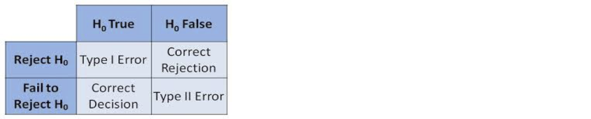

---
# Please do not edit this file directly; it is auto generated.
# Instead, please edit 01-Hypothesis-Testing.md in _episodes_rmd/
title: "Introduction to Hypothesis Testing"
teaching: 45
exercises: 10
questions:
- "What are inferential statistics?"
- "What is a hypothesis?"
- "How can I test a hypothesis?"
objectives:
- "Define a null and alternative hypothesis"
- "Understand the hypothesis-testing process"
- "Recognise the different types of hypothesis testing errors"
keypoints:
- "To be defined"
output: html_document
---

## Hypothesis Testing

The following is a well-established research pipeline: 
1. Define a research question, or hypothesis
2. Design an appropriate study or trial to test that hypothesis
3. Conduct the study or trial
4. Observe, collate and process the results (data)
5. Measure the agreement with the hypothesis
6. Draw conclusions regarding the hypothesis

In this model, the hypothesis should be clearly defined and testable. In 
hypothesis testing, this means that our question has just two possible answers: 
a ”null hypothesis” (H0), which is a specific statement that we are looking to
disprove with our data, and an “alternative hypothesis” (H1), which is a 
statement opposing H0 and which we will only accept if the data and analysis is 
sufficiently convincing. 

> ## Tip: Defining your alternative hypothesis
> The alternative hypothesis must cover all options not included in the null 
> hypothesis; if H0 is: “There is no difference between A and B”, then H1 must 
> be: “A and B are different”, not: “A is greater than B”. 
> Generally, a two-sided test (“A and B are different”) is regarded as better 
> practice than a one-sided test (“A is greater than B”).
{: .callout}

> ## Challenge 1
> 
> Imagine you were testing a new medical treatment. What might be the most 
> appropriate null and alternative hypotheses:
> 1. Null – the new treatment is worse than the existing treatment. Alternative – 
> the new treatment is better than the existing treatment
> 2. Null – there is no difference between the new and old treatments. Alternative
> – there is a difference between the new and existing treatments
> 3. Null – there is a difference between the new and existing treatments. 
> Alternative – there is no difference between the new and existing treatments
> 4. Null – there is no difference between the new and old treatments. Alternative
> – the new treatment is better than the existing treatment
>
> > ## Solution to challenge 1
> > 
> > Option 2 is the correct answer - the default assumption (the null hypothesis) is
> > that there is no difference between the two treatments, and we need convincing
> > evidence to accept that the new treatment has a different outcome (the
> > alternative hypothesis).
> > Think about why the other options may not be suitable. Can you come up with
> > another valid null and alternative hypothesis?
> {: .solution}
{: .challenge}

When carrying out hypothesis testing, we normally use a standard framework.
1. We establish our null and alternative hypothesis
2. We collect data, often by measurement or experimentation on a small sample 
group representative of the whole populations
3. From the data, we calculate a test statistic – an estimation of a population 
parameter derived from the data – and a rejection region – a range of values for
the test statistic for which we would reject H0 and accept H1
4. If the test statistic falls within the rejection region and we accept H1, we 
can calculate a P-value, the probability of the observed test statistic (or one 
more favourable to H1) occurring if H0 were true.

Hypothesis testing is often used in inferential statistics, where measurements 
are taken on a random sample from a large population in order to estimate (or 
infer) something about that population as a whole. Example of inferential 
statistics include opinion polls and drug trials.

> ## Challenge 2
> 
> Would results from a population census be an example of inferential statistics? 
> Discuss briefly with your neighbour.
>
> > ## Solution to challenge 2
> > 
> > Probably not, because a census is an attempt to directly 
> > measure the whole population, not just a representative sample. However there is
> > nearly always some missing data and inference may be used in an attempt to 
> > compensate for that.
> {: .solution}
{: .challenge}

## P-values and rejection of the null hypothesis
* The null hypothesis is tested against the alternative one using a 
distribution of a statistic
* The P-value is the probability of making a mistake by rejecting H0 even
if it is true
* The probability of rejecting H0, given the truth of H0, is called the 
significance level, denoted α (often α=0.05, but as low as α=0.0000003 in
some disciplines)
* If the P-value < 0.05, we are 95% confident when we reject H0 
  + Conclusion: we can reject H0

## Confidence intervals
A confidence interval gives more information than the results of a
hypothesis test (reject or don’t reject): it provides a range of
plausible values for the parameter being studied.
Example: If the sample mean is used to estimate the population mean, the
confidence interval gives the upper and lower bounds of a range in which
we have 95% confidence that the real population mean occurs.

> ## Challenge 3
> What conclusion can you make if your analysis gives a p-value of 0.994?
> 1. You can accept the alternative hypothesis with high confidence
> 2. You can accept the alternative hypothesis with low confidence
> 3. You should reject the alternative hypothesis
> 4. You can neither accept nor reject the alternative hypothesis
> > ## Solution to challenge 3
> > 
> > Option 3. If the p-value is above our chosen significance level (commonly 0.05, 0.01 or 0.001) we reject the alternative hypothesis
> {: .solution}
{: .challenge}

## Testing errors
In hypothesis testing, there are two possible causes for a false 
conclusion: rejecting the null hypothesis when it is true (a type I 
error), or failing to reject the null hypothesis when it is false (a type
II error). The probability of a type 1 error is given by the P-value; it
is possible to calculate the probability of a type II error, but we will 
not cover that in this course.

