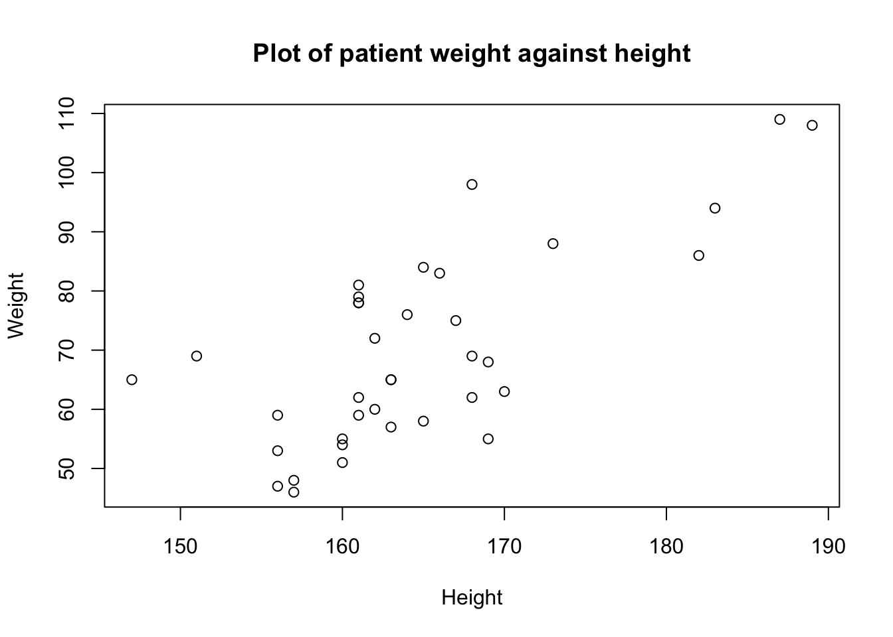
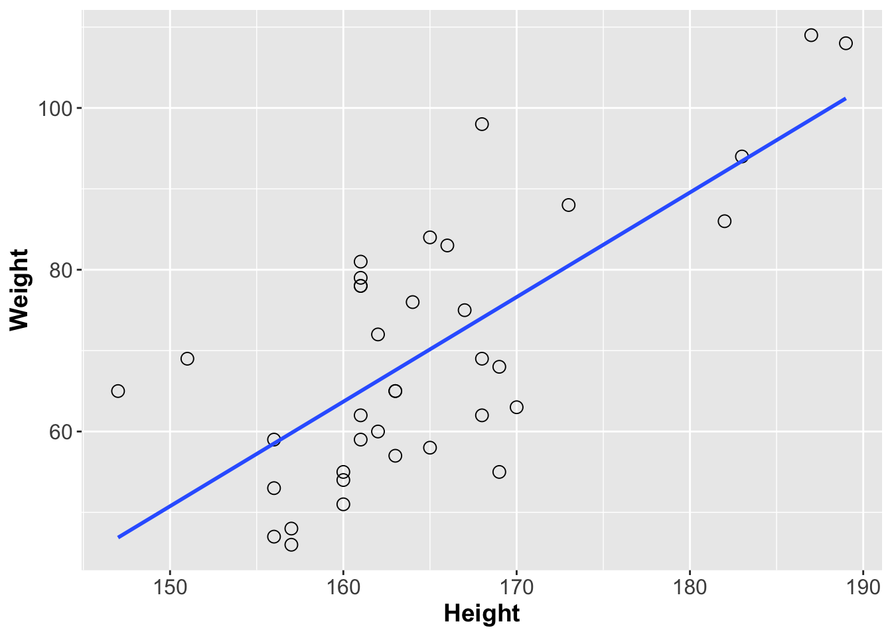
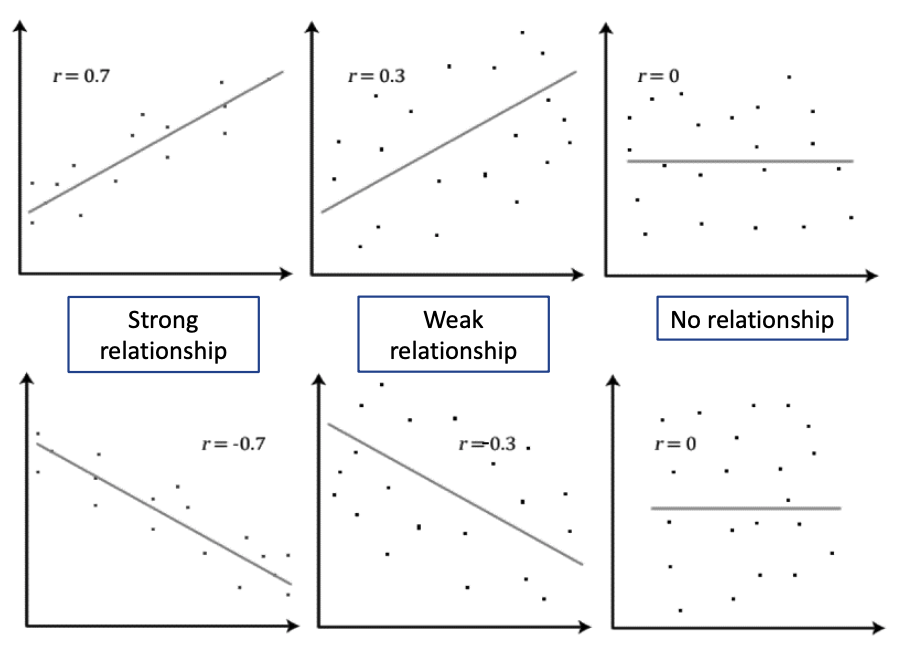

---
# Please do not edit this file directly; it is auto generated.
# Instead, please edit 03-Correlation.md in _episodes_rmd/
title: "Relationship between two continuous variables"
teaching: 45
exercises: 10
questions:
- "What are continuous variables?"
- "How do I evaluate the relationship between two continuous variables?"
objectives:
- "Exploring data with scatter plots"
- "Identifying positive and negative correlation"
- "Identifying and applying appropriate correlation tests"
- "Interpretation of correlation values and coefficient of determination"
keypoints:
- "Distinguish a continuous variable"
- "Review data using `plot` and `ggplot`"
- "Test for normality of a dataset using `shapiro.test`"
- "Calculate correlation coefficient using `cor` and `cor.test`"
- "Summarise continuous data using the `by` command"
output: html_document
---


## Introducing continuous variables

The first feature of our dataset we are going to investigate is to look at 
relationships between continuous variables. A continuous variable is one which
can take any value between a minimum and maximum possible value - measurements 
such as height, distance, or time. Continuous variables can be of interest to 
researchers when they show relationships in how they change; statistically we 
can evaluate relatedness using correlation analysis.

> ## Challenge 1
> 
> Which of the following datasets are continuous variables
> * The weight of a dog
> * The age of a dog
> * The breed of a dog
> * The colour of a dog
> > ## Solution to challenge 1
> > 
> > 1 and 2 are both continous variables, although age in particular is often 
> > recorded in whole (discrete) units such as months or years. Neither breed nor 
> > colour are continuous - a dog can be a mixed breed, and colour definitions may
> > merge into each other, but neither has a logical linear order (for example, 
> > neither a brown dog nor a Dalmation are part of a single continuum between a 
> > white dog and a black dog)
> {: .solution}
{: .challenge}

A correlation measures the 'degree of association' between two continuous 
variables. Associations can be:
* *positive* (an increase in one variable is associated with an increase in the 
other)
* *negative* (an increase in one variable is associated with a decrease in the
other)
* *non-linear* (as one variable increases, the other changes but not in a 
consistant way)


## Previewing relationships with scatter plots

The gallstones dataset contains a number of continuous variables. The first step
in studying potential relationships between these is to examine them using 
scatter plots


```r
plot(gallstones$Height, gallstones$Weight, 
     xlab = "Height", 
     ylab = "Weight",
     main = "Plot of patient weight against height")
```


From this graph, there appears to be a correlation between height and weight.
We can look at this further using ggplot, which provides them `geom_smooth` 
function with which you can add a line showing the best correlation estimate


```r
library(ggplot2)
ggplot(gallstones, aes(x = Height, y = Weight)) +
  geom_point(shape = 1, size = 3) +
  geom_smooth(method = lm, se = F) +
  theme(axis.text = element_text(size = 12),
        axis.title = element_text(size = 14, face = "bold"))
```


> ## Challenge 2
> 
> Pick a pair of continuous variables from the dataset and visulise them using
> the plot function. Do they appear to be correlated?
> > ## Solution to challenge 2
> > 
> > There are six continuous variables in the gallstones dataset: Height, 
> > Weight, Age, BMI, Diam and Dis. Using Weight and BMI as an example:
> > `plot(gallstones$Weight, gallstones$BMI)`
> >
> > Two variables - Diam and Dis - are skewed towards the low end of values. Try 
> > log-transforming these (`log10(gallstones$Diam)`) and see what impact this
> > has on the plot.
> {: .solution}
{: .challenge}

## Calculating the degree of association

Having visualised the data and identified that it shows signs of an association
between the variables, the next step is to quantify the degree of association, 
or **correlation** between the variables. There are different tests for measuring 
correlation, depending on the distribution of those variables. Today we will 
focus mainly on two: Pearson's correlation coefficient and Spearman's rank. 

Pearson's correlation coefficient is used with two continuous variables, both of
which are normally distributed, and which show a linear relationship. Spearman's 
rank is for when there are two continuous variables, but at least one is not 
normally distributed. An associated test, Shapiro-Wilk, can be used to determine
whether the data can be treated as normally distributed or not.

Both Pearson's and Spearman's tests give a correlation value 'r' between the two 
variable supplied. This value indicates the degree of association between the
variables

* |r| = 0 No relationship
* |r| = 1 Perfect *linear* relationship
* |r| < 0.3 Weak relationship
* 0.3 ≤ |r| ≤ 0.7 Moderate relationship 
* |r| = 0.7 Strong relationship



> ## Tip: Coefficient of determination
> Pearson's *__r__* can be squared, *__r^2^__*, to derive a coefficient of 
> determination. This is the portion of variability in one of the variables that 
> can be accounted for by the variability in the second one
> For example, if the Pearson's correlation coefficient between two variables X 
> and Y is -0.7 (strong negative relationship), 49% of the variability in X is 
> determined by the variability in Y
{: .callout}

From our plot, we have already established that Height and Weight seem to be 
correlated, so we will calculate the correlation value for these variables.


```r
# First, test if the variables are normally distributed
shapiro.test(gallstones$Height)
```

```
## 
## 	Shapiro-Wilk normality test
## 
## data:  gallstones$Height
## W = 0.89975, p-value = 0.002901
```

```r
shapiro.test(gallstones$Weight)
```

```
## 
## 	Shapiro-Wilk normality test
## 
## data:  gallstones$Weight
## W = 0.94652, p-value = 0.07454
```

The p-value of the Shapiro-Wilk test for Height is less than 0.05, so we accept 
the alternative hypothesis that Height is not normally distributed. Therefore we 
should use Spearman's test for this analysis.


```r
cor.test(gallstones$Height, gallstones$Weight, method="spearman", exact=FALSE)
```

```
## 
## 	Spearman's rank correlation rho
## 
## data:  gallstones$Height and gallstones$Weight
## S = 3246.8, p-value = 5.093e-05
## alternative hypothesis: true rho is not equal to 0
## sample estimates:
##       rho 
## 0.6151261
```

The *rho* value of 0.615 shows a moderate relationship between height and 
weight, and the p-value indicates that we can be highly confident that the 
correlation is significantly different from zero.

> ## Challenge 3
> 
> Import the example dataset in the file "data/ep03_data.RData" using the 
> command `load(data/ep03_data.RData")`. This will load three dataframes of x
> and y coordinates. Without plotting the data, carry out some basic statistical
> tests (mean, standard deviation, correlation) on the three dataframes and see 
> if you can characterise the differences between them. Then plot them and see 
> if your interpretations were correct
> > 
> > ## Solution to challenge 3
> > 
> > Example commands: `mean(data1$x)`, `sd(data2$y)`, 
> > `cor.test(data3$x, data3$y)`
> >
> > Example plot command: `plot(data1$x, data1$y)`
> > 
> > Did you expect this result? How important is visualising data?
> {: .solution}
{: .challenge}
