---
# Please do not edit this file directly; it is auto generated.
# Instead, please edit 06-ANOVA.md in _episodes_rmd/
title: "Testing For More Than Two Groups"
teaching: 45
exercises: 10
questions:
- "Are the group means different among three or more groups?"
objectives:
- "Identify situations needing multiple sample tests and choose the correct test 
for the type of data"
- "Perform one and two-way ANOVA testing"
- "Recognise interaction effects in multiple-category testing"
- "Interpret test results and apply post hoc testing"
keypoints:
- "Identify situations needing multiple sample tests and choose the relevant 
test using the decision tree" 
- "Perform multi-group testing using `aov` and `kruskal.test`"
- "Perform and interpret post hoc tests using `TukeyHSD` and `kwAllPairsDunnTest`"
- "Study interactions using `interaction.plot` and `aov`"
- "Check model assumptions using `plot`"

output: html_document
---


## Comparison of multiple groups

The T-test, Mann-Whitney Test and others discussed earlier are designed to 
identify differences in the means or medians of two groups. When working with 
data that is in three or more groups, where we are testing if there is a 
difference between any one of those groups with the others, we need to use other
tests. As with two-sample testing, the appropriate test is determined in large
part by whether the data in each group is normally distributed, and whether the
data is paired, as outlined in the figure below.

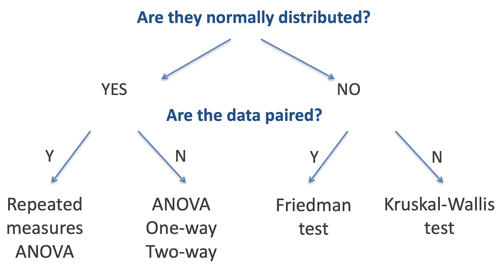

> ## Challenge 1
>
> Based on what you have learned previously in this workshop, how can we best
> determine whether the data in each sample is normally distributed
> > ## Solution to Challenge 1
> > 
> > We can use the `shapiro.test` function to test for normality - or rather, to 
> > test the alternative hypothesis that the data is not normally distributed. 
> > Use the `by` function to test all categories in one command: 
> > 
> > ```r
> > by(data$measurement, data$category, shapiro.test)
> > ```
> > Remember, as with the two sample tests, if any one group is not normally
> > distributed, the whole analysis must be performed with the relevant 
> > non-parametric test
> {: .solution}
{: .challenge}

## ANOVA Testing - One-way

The one-way ANOVA compares whether there is a difference in the mean values of 
three or more groups. It requires one continuous (and normally distributed) 
measurement variable, and one categorical variable (with three or more 
categories). 

Assumptions for the one-way ANOVA are:
* Independant samples
* Normal distribution in each group
* Homogeneity of variances

The null hypothesis for one-way ANOVA is that the means of all groups are equal;
the alternative hypothesis is that at least one of the means is different from the 
others.

H<sub>0</sub>: µ<sub>1</sub> = µ<sub>2</sub> = µ<sub>3</sub> = ... = µ<sub>k</sub>  
H<sub>1</sub>: µ<sub>1</sub> ≠ µ<sub>2</sub> OR µ<sub>1</sub> ≠ µ<sub>3</sub> OR 
µ<sub>2</sub> ≠ µ<sub>3</sub> ....

The ANOVA extension of the t-test is called the **F-test**, and is based around 
decomposing the total variation in the sample into the variability (sum of 
squares) within groups and between groups

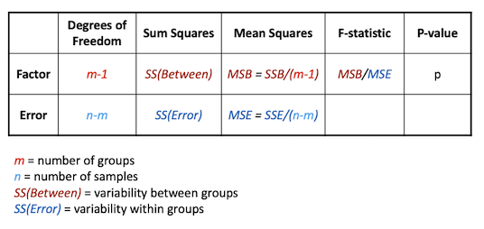

## ANOVA one-way example

In our example dataset, the alcohol consumption field has three categories. We 
will test if there is any effect on weight associated with the alcohol 
consumption category.

### Variables of interest
* Alcohol consumption: Categorical (1, 2 or 3)
* Weight: Continuous

There are two variables - one categorical with more than two levels and one 
continuous. The data are not paired - all the measurements are from different 
patients. So based on the decision tree, the appropriate test is either one-way
ANOVA or Kruskal-Wallis test. The choice between these is made depending on 
whether the data is normally distributed or not

```r
by(gallstones$Weight, gallstones$Alcohol.Consumption, shapiro.test)
```

~~~
## gallstones$Alcohol.Consumption: NonAlcohol
## 
## 	Shapiro-Wilk normality test
## 
## data:  dd[x, ]
## W = 0.79876, p-value = 0.01976
## 
## ------------------------------------------------------------ 
## gallstones$Alcohol.Consumption: Previous
## 
## 	Shapiro-Wilk normality test
## 
## data:  dd[x, ]
## W = 0.95864, p-value = 0.7703
## 
## ------------------------------------------------------------ 
## gallstones$Alcohol.Consumption: Alcohol
## 
## 	Shapiro-Wilk normality test
## 
## data:  dd[x, ]
## W = 0.94549, p-value = 0.3588
~~~
{: .output}

The Shapiro test for group 1 gives a significant p-value, indicating that we 
should reject the null hypothesis that the data is normally distributed. This 
would indicate that the Kruskal-Wallis test is the appropriate one for this 
analysis


```r
kruskal.test(gallstones$Weight ~ gallstones$Alcohol.Consumption)
```

~~~
## 
## 	Kruskal-Wallis rank sum test
## 
## data:  gallstones$Weight by gallstones$Alcohol.Consumption
## Kruskal-Wallis chi-squared = 0.89142, df = 2, p-value = 0.6404
~~~
{: .output}


```r
plot(gallstones$Weight ~ gallstones$Alcohol.Consumption)
```

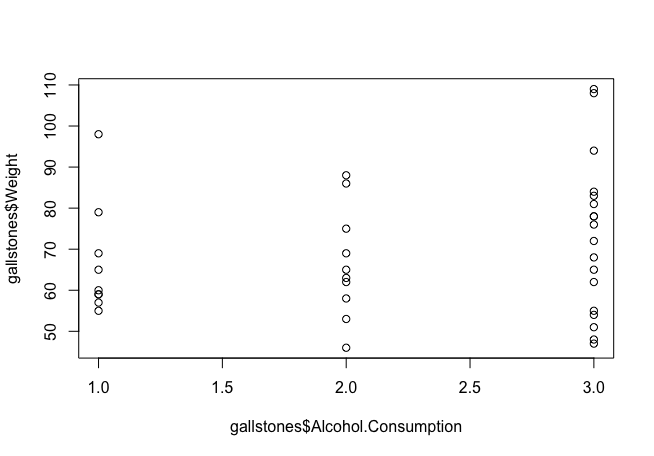

We can see that with a p-value of 0.64, we reject the alternative hypothesis and
concluded that in this data set, there is no evidence for a difference in 
patient weight associated with their level of alcohol consumption. This is 
consistent with the plot, which doesn't show any clear differences between the
three categories.

For comparison and practice, let's also perform an ANOVA

```r
result <- aov(gallstones$Weight~gallstones$Alcohol.Consumption)
summary(result)
```

~~~
##                                Df Sum Sq Mean Sq F value Pr(>F)
## gallstones$Alcohol.Consumption  2    369   184.4   0.685  0.511
## Residuals                      34   9151   269.1
~~~
{: .output}


Like the Kruskal-Wallis test, this ANOVA also gives a non-significant p-value, 
but remember, it is not the appropriate test for non-normally distributed data
so would not be a valid test anyway.

### _Post-Hoc_ testing
The one-way ANOVA and Kruskal-Wallis tests only identify that one (or more) of 
the groups has a significant difference to the others. To go further, we would
want to identify which group(s) were different. For this we would use a 
**_Post-hoc_ test**, either Tukeys' HSD for ANOVA or Dunn's test (in the 
PMCMRplus package) for Kruskal-Wallis. This performs a multiple-testing 
corrected pairwise comparison between each combination of groups to highlight 
which (if any) are different.


```r
# Dunn's test, since we used Kruskal-Wallis for the initial analysis
library(PMCMRplus)
kwAllPairsDunnTest(x=gallstones$Weight, g=as.integer(gallstones$Alcohol.Consumption), 
                   p.adjust.method="bonferroni")
```

~~~
## Warning in kwAllPairsDunnTest.default(x = gallstones$Weight, g =
## as.integer(gallstones$Alcohol.Consumption), : Ties are present. z-quantiles were
## corrected for ties.

## 
## 	Pairwise comparisons using Dunn's all-pairs test

## data: gallstones$Weight and as.integer(gallstones$Alcohol.Consumption)

##   1 2
## 2 1 -
## 3 1 1

## 
## P value adjustment method: bonferroni

## alternative hypothesis: two.sided
~~~
{: .output}

The row and column headers in the table just below halfway through the output
show the group identifiers, and the values in the table are the p-values. In 
this case, the p-values are all 1 - there is not evidence for even the slightest 
difference between the groups!

If there is a significant p-value with a one-way ANOVA, use the Tukey HSD test

```r
TukeyHSD(result)
```

~~~
##   Tukey multiple comparisons of means
##     95% family-wise confidence level
## 
## Fit: aov(formula = gallstones$Weight ~ gallstones$Alcohol.Consumption)
## 
## $`gallstones$Alcohol.Consumption`
##                           diff       lwr      upr     p adj
## Previous-NonAlcohol -0.2777778 -18.74892 18.19336 0.9992516
## Alcohol-NonAlcohol   6.1666667 -10.24537 22.57870 0.6311298
## Alcohol-Previous     6.4444444  -9.41109 22.29998 0.5844049
~~~
{: .output}

The layout here is different to the Dunn's test with one row per comparison
rather than a grid format, but the principle is the same, with the p-value
reported for each pairwise comparison

> ## Challenge 2
>
> For a more interesting analysis, try creating a dummy dataset with the weight 
> of patients doubled for just one category of Alcohol.Consumption and then 
> repeat the Kruskal-Wallis and Dunn's tests. Does this show a significant 
> difference as you might expect?
> > ## Solution to Challenge 2
> >
> >
> > 
> > ```r
> > # Create a copy of the gallstones data frame so as not to break things later
> > dummy_data <- gallstones
> > # Double the weight for Alcohol.Consumption category 3
> > ac_three <- which(gallstones$Weight == 3)
> > dummy_data[ac_three, "Weight"] <- 2 * dummy_data[ac_three, "Weight"]
> > # Then do the testing
> > kruskal.test(dummy_data$Weight ~ dummy_data$Alcohol.Consumption)
> > kwAllPairsDunnTest(x=dummy_data$Weight, g=dummy_data$Alcohol.Consumption,
> >                    p.adjust.method="bonferroni")
> > ```
> {: .solution}
{: .challenge}

> ## Challenge 3
>
> Try using the dummmy dataset from challenge 2 for an ANOVA and Tukey's test
> > ## Solution to Challenge 2
> >
> >
> > 
> > ```r
> > dummy_result <- aov(dummy_data$Weight ~ dummy_data$Alcohol.Consumption)
> > summary(dummy_result)
> > TukeyHSD(dummy_result)
> > ```
> {: .solution}
{: .challenge}

## ANOVA Testing - Two-way

An alternative application of ANOVA testing is where there are two categorical
variables (or factors) and one continuous measurement variable. This is commonly
used where the effect of a treatment or intervention might be different between
subsets of the test population - in other words, where there is a possibility of
an interaction between the two factors. A common situation might be a different 
response of male and female patients to a drug treatment, which is the example 
that we will use here.

### Two-way ANOVA example
The dataset we will use here is a small study to investigate the influence of 
Prozac on the reported 'happiness score' of patients, and whether males and 
female patients respond differently.
* Happiness score recorded for 24 patients
* Patients randomised to either placebo or Prozac **treatment** (first factor)
* Patients **gender** recorded (second factor)

Read the data in from the file "happiness.csv"

```r
# As before, we need to specify the stringsAsfactors flag for read.csv
happiness <- read.csv("data/happiness.csv", stringsAsFactors = TRUE)
happiness
```

~~~
##    Patient Score Gender Treatment
## 1        1   3.0   Male   Placebo
## 2        2   4.0   Male   Placebo
## 3        3   2.0   Male   Placebo
## 4        4   3.0   Male   Placebo
## 5        5   4.0   Male   Placebo
## 6        6   3.0   Male   Placebo
## 7        7   4.0 Female   Placebo
## 8        8   5.0 Female   Placebo
## 9        9   4.0 Female   Placebo
## 10      10   6.0 Female   Placebo
## 11      11   6.0 Female   Placebo
## 12      12   4.5 Female   Placebo
## 13      13   7.0   Male    Prozac
## 14      14   7.0   Male    Prozac
## 15      15   6.0   Male    Prozac
## 16      16   5.0   Male    Prozac
## 17      17   6.0   Male    Prozac
## 18      18   6.0   Male    Prozac
## 19      19   5.0 Female    Prozac
## 20      20   5.0 Female    Prozac
## 21      21   5.0 Female    Prozac
## 22      22   4.0 Female    Prozac
## 23      23   6.0 Female    Prozac
## 24      24   6.0 Female    Prozac
~~~
{: .output}

This corresponds to this design:

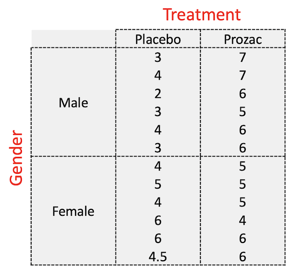

As usual, an early step in studying our data is to visualise it

```r
# First, plot just using each of the factors independently
par(mfrow=c(1,2))
plot(Score ~ Treatment + Gender, data = happiness)
par(mfrow=c(1,1))
```

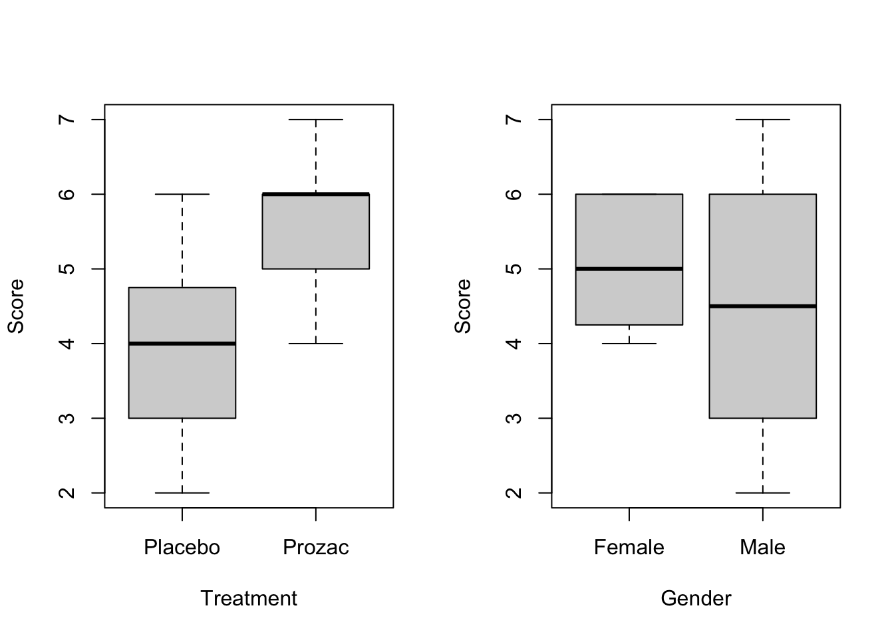

```r
# Then using ggplot to separate out the four different combinations of factor
ggplot(data = happiness, aes(x = Treatment, y = Score, fill = Gender)) +
  geom_boxplot(postion = position_dodge())
```

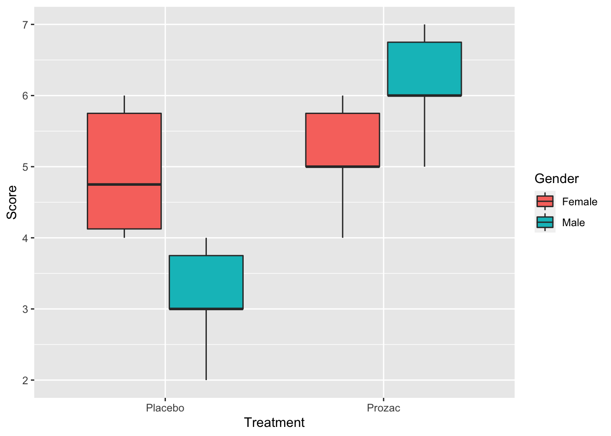

Judging by the boxplots, there appears to be a difference in happiness score for 
the different treatment drugs (score higher with treatment than placebo). 
However, the difference is less pronounced between the gender groups.

Two-way ANOVA tests for two things:
**Main effects** - each factor independently
* Are patients happier on placebo or Prozac
* Do males and females differ in happiness score

**Interaction effects** - the effects of one factor are different depending on 
the level (category) of the other factor
* Treatment x Gender: Males may be happier on Prozac than placebo, but females 
may not have a different response between the two. Or _vice versa_. The diagram
below shows examples of (left) where both main effects have a difference but 
there is no interaction and (right) where there is a strong interaction but
little main effect.

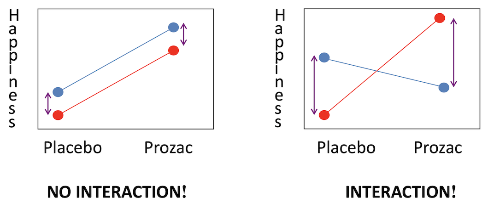

Interaction plots can be made in R using the `interaction.plot` command. Note 
the order of factors - switching these alters which variable is plotted on the 
x-axis.

```r
interaction.plot(happiness$Treatment, happiness$Gender, happiness$Score,
                 col=2:3, lwd=3)
```

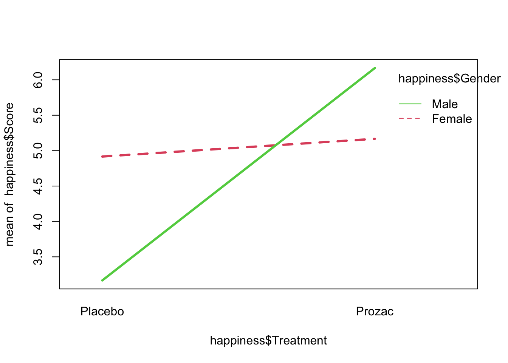

The interaction plot seems to show that there is a strong interaction effect 
between Treatment and Gender on happiness score, but to confirm that we can fit
a two-way ANOVA with an interaction term. 

```r
# Option 1 - the most commonly used
result <- aov(Score~Treatment+Gender+Treatment*Gender, data=happiness)
summary(result)
```

~~~
##                  Df Sum Sq Mean Sq F value   Pr(>F)    
## Treatment         1 15.844  15.844  24.934 6.98e-05 ***
## Gender            1  0.844   0.844   1.328 0.262773    
## Treatment:Gender  1 11.344  11.344  17.852 0.000415 ***
## Residuals        20 12.708   0.635                     
## ---
## Signif. codes:  0 '***' 0.001 '**' 0.01 '*' 0.05 '.' 0.1 ' ' 1
~~~
{: .output}

```r
# Option 2 - gives identical results under most circumstances
result_2 <- lm(Score~Treatment+Gender+Treatment*Gender, data=happiness)
anova(result_2)
```

~~~
## Analysis of Variance Table
## 
## Response: Score
##                  Df  Sum Sq Mean Sq F value    Pr(>F)    
## Treatment         1 15.8437 15.8437 24.9344 6.977e-05 ***
## Gender            1  0.8437  0.8437  1.3279 0.2627729    
## Treatment:Gender  1 11.3437 11.3437 17.8525 0.0004155 ***
## Residuals        20 12.7083  0.6354                      
## ---
## Signif. codes:  0 '***' 0.001 '**' 0.01 '*' 0.05 '.' 0.1 ' ' 1
~~~
{: .output}

### Interpretation of two-way ANOVA output
#### Treatment
The final column Pr(>F) is the p-value; at 7x10<sup>-5</sup> this
is well within the cutoff for statistical significance. Therefore we conclude
that treatment with Prozac has a significant effect on happiness. From our plots
it appears that Prozac is associated with higher happiness scores, but this 
should be confirmed with _post hoc_ testing.

#### Gender
The p-value for gender is not signficant, so there is not evidence for
a gender effect on happiness; that is, there is no difference in happiness 
levels between males and females.

#### Treatment:Gender
This has a significant p-value, indicating that there is an 
interaction between gender and treatment. The plots suggest that is because 
Prozac increases happiness in men more than in women, but again this should be 
confirmed with _post hoc_ testing.


```r
# For ANOVA performed with `aov()`, used TukeyHSD for post hoc testing
result <- aov(Score~Treatment+Gender+Treatment*Gender, data=happiness)
TukeyHSD(result)
```

~~~
##   Tukey multiple comparisons of means
##     95% family-wise confidence level
## 
## Fit: aov(formula = Score ~ Treatment + Gender + Treatment * Gender, data = happiness)
## 
## $Treatment
##                 diff       lwr      upr    p adj
## Prozac-Placebo 1.625 0.9461711 2.303829 6.98e-05
## 
## $Gender
##               diff       lwr       upr     p adj
## Male-Female -0.375 -1.053829 0.3038289 0.2627729
## 
## $`Treatment:Gender`
##                               diff         lwr        upr     p adj
## Prozac:Female-Placebo:Female  0.25 -1.03813584  1.5381358 0.9472984
## Placebo:Male-Placebo:Female  -1.75 -3.03813584 -0.4618642 0.0056547
## Prozac:Male-Placebo:Female    1.25 -0.03813584  2.5381358 0.0591502
## Placebo:Male-Prozac:Female   -2.00 -3.28813584 -0.7118642 0.0016445
## Prozac:Male-Prozac:Female     1.00 -0.28813584  2.2881358 0.1650724
## Prozac:Male-Placebo:Male      3.00  1.71186416  4.2881358 0.0000132
~~~
{: .output}

The $Treatment section of this output supports our conclusion from the two-way
ANOVA that Prozac increases happiness score, by an average of 1.6 happiness 
units (95% CI: 0.95-2.3). The $Treatment:Gender section indicates that Prozac 
has no effect on happiness in females (or at least, not a statistically 
signficant effect), but in males it increases happiness by approximatey 3.0 
units.

### Checking assumptions
After fitting an ANOVA model it is important to always check the relevant model
assumptions. This includes making QQ-plots and residual plots

```r
plot(result)
```

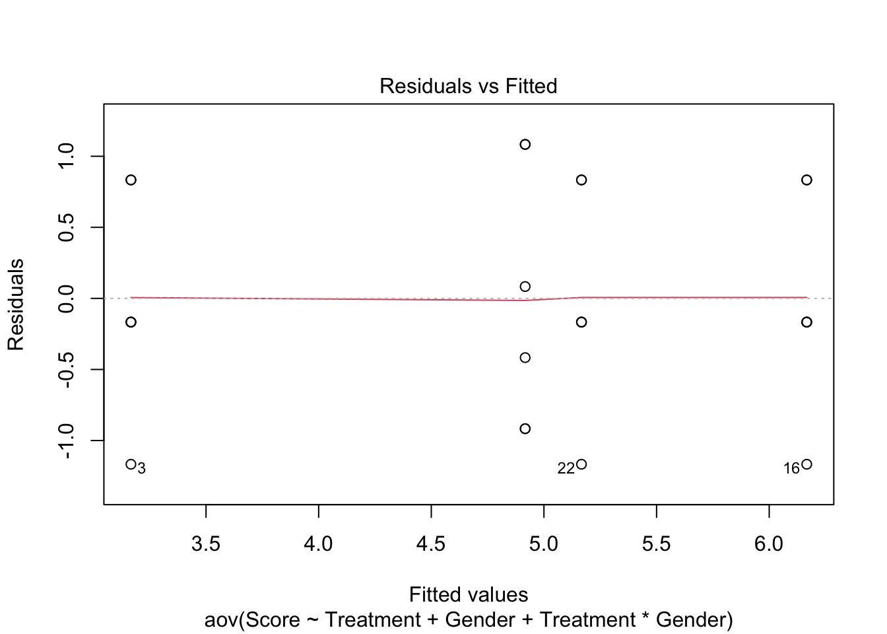
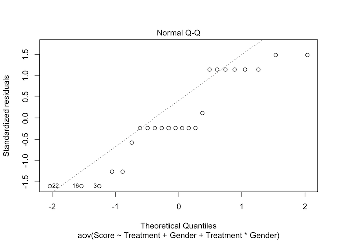
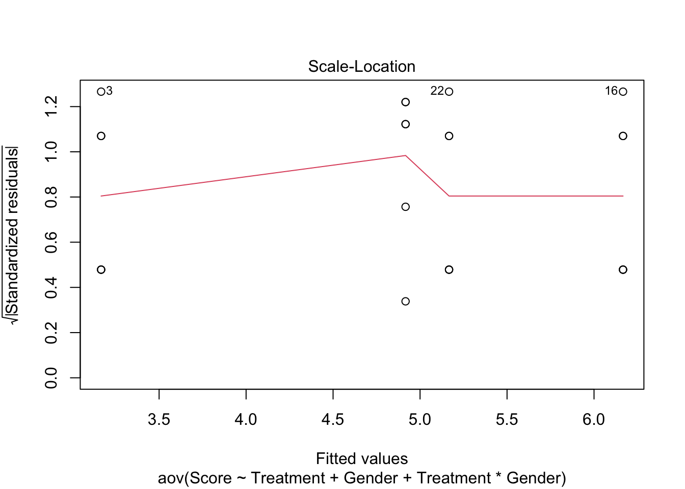
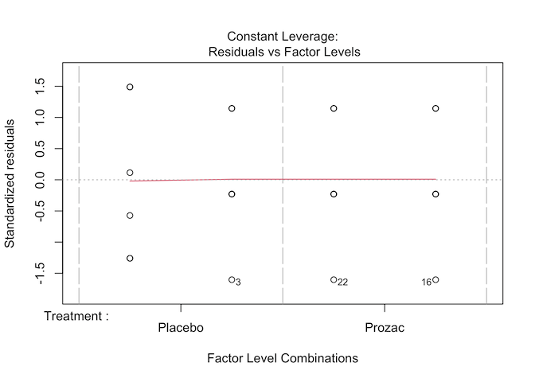

#### Characteristics of a well-behaved residual vs. fits plot
1. The residuals "bounce randomly" around the 0 line. This suggests that the 
assumption that the relationship is linear is reasonable.

2. The residuals roughly form a "horizontal band" around the 0 line. This 
suggests that the variances of the error terms are equal.

3. No one residual "stands out" from the basic random pattern of residuals. This 
suggests that there are no outliers.

#### Characteristics of a well-behaved Q-Q plot
1. If the points on the q-q plot fall approximately on a straight line, the 
residuals are considered to be normally distributed.

2. If some points are far from the line have a deeper look to see if they are 
outliers.

In this case, it appears that there is a deviation from normality because many
of the points do not fall on the straight line.
 
#### Scale location plot
Square root of the standardized residuals (sort of a square root of relative 
error) as a function of the fitted values. Again, there should be no obvious 
trend in this plot.

#### Point Leverage plot
Measure of importance of each point in determining the regression result. 
Superimposed on the plot are contour lines for the Cook’s distance (another 
measure of the importance of each observation). 

Smaller distances means that removing the observation has little affect on the 
regression results. Distances larger than 2 are suspicious and suggest the 
presence of a possible outlier.

## Paired data with more than two samples

The two-way ANOVA and Kruskal-Wallis test are both intended for use with 
independent sets of data, as outlined in the decision tree at the start of this
section. As with several other tests we have explored in this course, there are 
alternatives that should be used when data points are paired - in other words,
where there are multiple measurements on the same subject. These are the 
**Repeated measures ANOVA** and the **Friedman test**, for normally distributed 
and non-normally distributed data respectively.

Typical study designs where you might use paired data analysis approaches 
include:

* Studies that investigate changes in mean scores over three or more time points
* Studies that investigate differences in mean scores under three or more
different conditions.

These more advanced tests are beyond the scope of this workshop, but some are
covered in our **Longitudinal and Mixed Model Analysis** course.

> ## Challenge 4
> Can you think of a modification to our Happiness trial example which would 
> mean it should be analysed using a paired data technique?
>
> > ## Solution to Challenge 4
> > One option would be that if, rather than testing on 24 individuals assigned
> > randomly to placebo/treatment groups, the trial was instead carried out with
> > 12 people and happiness scores recorded before and after treatment with 
> > Prozac. Or perhaps a stricter design - 24 individuals treated with either 
> > Prozac or placebo, with happiness scores recorded before and after 
> > treatment.
> {: .solution}
{: .challenge}

