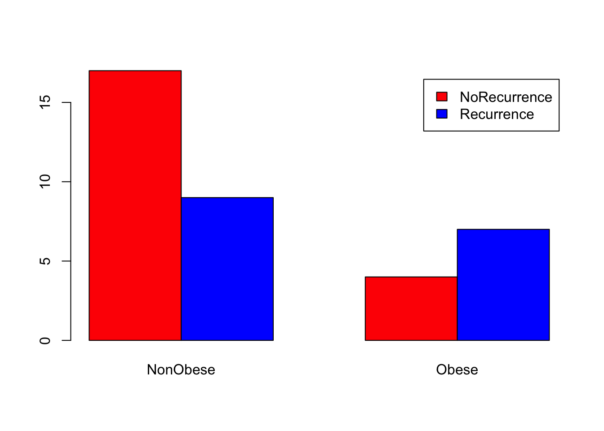
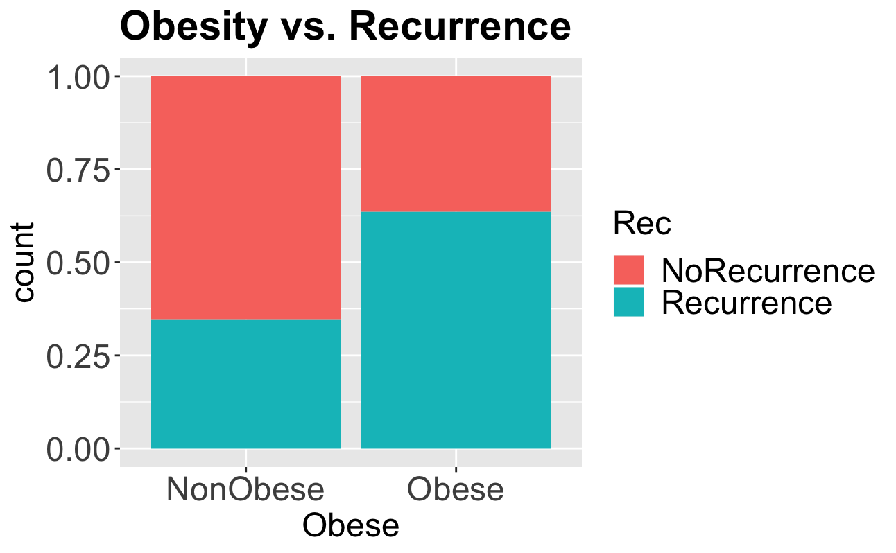

```{r setup, include=FALSE}
knitr::opts_chunk$set(echo = TRUE)
gallstones <- read.csv("data/gallstones.csv", stringsAsFactors = TRUE)
gallstones$Patient_ID <- as.character(gallstones$Patient_ID)
library(ggplot2)
```

## Introducing categorical data

Having looked at the gallstones dataset, you will have noticed that many of the
columns contain just two or three distinct values - for example, M and F, or 1,
2, and 3. These are examples of __categorical__ data - where samples are 
assigned to one of a limited number of fixed, distinct categories. Categories 
may be emergent features of the data (for example 'received treatment' and 'did 
not receive treatment') but others may be more arbitrary according to the needs
of the analysis (in this dataset, the three levels of alcohol consumption relate
to 'no consumption', 'previous consumer' and 'current consumer').

Because categorical data typically has no intrinsic ordering to the categories,
we cannot study relationships between two variables by looking for correlations.
Instead, statistical analysis of categorical data is based around count 
frequencies - are the numbers of samples in each category what would be expected
from random distribution, or do certain categories occur together more often
than would happen just by chance?

## Ordinal data

An intermediate between categorical data and continuous data is __ordinal__ 
data. Unlike categorical data, ordinal data does have natural order to the 
categories, but samples are still assigned to one of a fixed number of 
categories. For example, it is common on survey forms to see an ordinal age 
field: under 15, 15-25, 26-40, etc. Ordinal data is outside the scope of today's
workshop - talk to a statistician if you need more advice.

> ## Challenge 1
>
> Look again at the gallstones dataset. How many categorical fields does it 
> contain?
> > ## Solution to Challenge 1
> > 
> > There are seven categorical fields in this dataset: Gender, Obese, 
> > Smoking.Status, Alcohol.Consumption, Treatment, Rec, and Mult
> {: .solution}
{: .challenge}

## Using factors for categorical data

With the exception of Gender, all the categorical variables in the gallstones
dataframe have been recorded as integer fields. This may cause confusion because
it would be possible in principle to analyse these as continuous variables. R 
includes the factor data type, which provides a way to store a fixed, predefined
set of values. This makes it ideal for working with categories, so we will
convert those columns to factors.

```{r}
# Either convert the columns one at a time
gallstones$Obese <- as.factor(gallstones$Obese) # and repeat for other five
# Or all together: variables Obese to Mult (columns 7-12) need to be categorical
gallstones[,7:12] <- data.frame(lapply(gallstones[,7:12], as.factor))

# While we're at it, convert the levels to meaningful category names
levels(gallstones$Obese) <- c("NonObese", "Obese")
levels(gallstones$Treatment) <- c("Untreated", "Treated")
levels(gallstones$Rec) <- c("NoRecurrence", "Recurrence")
levels(gallstones$Smoking.Status)<-c("NonSmoker","Smoker")
levels(gallstones$Alcohol.Consumption)<-c("NonAlcohol","Previous","Alcohol")
levels(gallstones$Mult)<-c("Single","Multiple")
str(gallstones)
```

## Visualising categorical data

As with continuous data, it can often be useful to visualise categorical data
before starting on more complex analysis. We can do this numerically with a 
simple count table, or graphically by expressing that table as a bar graph. For
this example, we will test whether there is a relationship between obesity and 
the recurrence of gallstones.

```{r eval=FALSE}
# Plots are generally easier to interpret than tables, so plot data first
barplot(counts, beside=TRUE, legend=rownames(counts), col = c('red','blue'))
```

```{r eval=FALSE}
# ggplot can be used for higher quality figures, and to plot proportions rather
# than counts
ggplot(gallstones, aes(Obese, fill=Rec)) + 
  geom_bar(position="fill") +
  scale_y_continuous(labels=scales::percent) +
  theme(axis.text=element_text(size=14),
        legend.text=element_text(size=14),
        legend.title=element_text(size=14),
        axis.title=element_text(size=14),
        plot.title = element_text(size=18, face="bold")) +
  ylab("proportion") +
  ggtitle("Obesity vs. Recurrence") 
```


```{r}
# Summarise the data into a table.
counts <- table(gallstones$Obese, gallstones$Rec)
counts
```

From the charts and table it certainly looks like obesity is associated with a
higher rate of recurrence, so we will test whether that is statistically
significant.

## Statistical tests for categorical variables

To carry out a statistical test, we need a null and alternative hypothesis. In 
most cases, the null hypothesis H<sub>0</sub> is that the proportion of samples
in each category is the same in both groups. 

Our question: Is there a relationship between obesity and gallstone recurrence?

_Hypotheses_:  
  H<sub>0</sub>: Gallstone recurrence is independent of obesity  
  H<sub>1</sub>: Gallstone recurrence is linked with obesity  

There are three main hypothesis tests for categorical variables:
* *Chi-square test* `chisq.test()`: used when the _expected_ count in each cell
of the table is greater than 5
* *Fisher's exact test* `fisher.test()`: used when the expected count of at
least one cell is ≤ 5
* *McNemar test* `mcnemar.test()`: used for paired data - for example, the
proportion of patients showing a particular symptom before and after treatment

Which test do we need? The data is not paired, so it is not the McNemar test.
What are the expected counts for each cell?

```{r}
# CrossTable from gmodels library gives expected counts, and also proportions
library(gmodels)
CrossTable(gallstones$Rec, gallstones$Obese, 
           format = "SPSS", expected = T, prop.chisq = F)
```

This is slightly complicated output, but we are most interested in the "Expected 
Values" and "Column Percent" figures - the second and fourth line of each box. 
These show: 
1. The expected number of obese patients suffering recurrence is 4.757 (<5)
2. The recurrence rate in non-obese patients is 34.6%, whereas in obese patients 
it is 63.6%

Because one expected value is less than 5, we should use Fisher's Exact test
```{r}
fisher.test(gallstones$Obese, gallstones$Rec)
```
Perhaps surprisingly given the plot data, the p-value of this test is not 
significant; this means that there is insufficient evidence to conclude that
there is any difference in recurrence rates between obese and
non-obese patients. The apparently higher rate of recurrence in obese patients
is no more than might be expected by random chance in a sample group of this
size. It is possible however that we have made a type II error and incorrectly
failed to reject H<sub>0</sub> - we should have consulted a statistician before
gathering the data to check whether the sample size provided sufficient
statistical power to detect a relationship.

> ## Challenge 2
> 
> When would you use the Chi-square test
> 1. When one variable is categorical and the other continuous
> 2. When there is categorical data with more than five counts expected in each 
> cell
> 3. When there is paired categorical data
> 4. You can use it interchangeably with Fisher's Exact test
> 
> > ## Solution to Challenge 2
> > 
> > Answer: 2
> {: .solution}
{: .challenge}

> ## Challenge 3
> Repeat the analysis to test whether recurrence is affected by treatment. 
> 
> Prepare simple and proportion/expected tables, prepare a bar chart, identify 
> and perform the appropriate statistical test.
> > ## Solution to Challenge 3
> > 
> > ```{r eval=FALSE}
> > # Create the initial counts table
> > counts <- table(gallstones$Treatment, gallstones$Rec)
> > counts
> >
> > # Plot using barplot
> > barplot(counts, beside = TRUE, legend = rownames(counts), col = c('red','blue'))
> > # Or plot using ggplot
> > ggplot(gallstones, aes(Treatment, fill=Rec)) + 
> >   geom_bar(position="dodge") +
> >   theme(axis.text=element_text(size=14),
> >         legend.text=element_text(size=14),
> >         legend.title=element_text(size=14),
> >         axis.title=element_text(size=14),
> >         plot.title = element_text(size=18, face="bold")) +
> >   ggtitle("Treatment vs. Recurrence") 
> > 
> > # Look at expected values to select Chi-square or Fisher's Exact
> > library(gmodels) # Optional if the library is already installed
> > CrossTable(data$Rec,data$Treatment,format="SPSS",prop.chisq=F,expected=T)
> > 
> > # All expected values are greater than 5
> > chisq.test(gallstones$Treatment, gallstones$Rec)
> > ```
> > Again, despite the barplot suggesting an association, the p-value is 
> > non-significant, so we reject the alternative hypothesis that treatment has
> > an effect on recurrence rate
> {: .solution}
{: .challenge}
