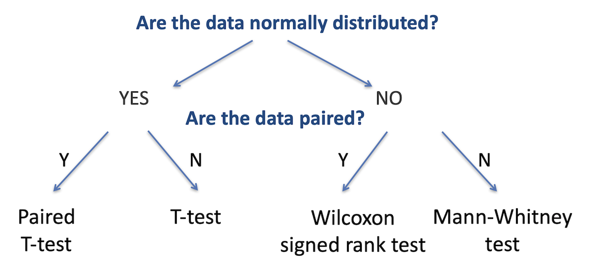

```{r setup, include=FALSE}
knitr::opts_chunk$set(echo = TRUE)
gallstones <- read.csv("data/gallstones.csv")
library(ggplot2)
```

## Comparison of two sample groups

Earlier we discussed continuous data, and how to investigate relationships 
(correlations) between two continuous variables. In this section, we will learn 
how to identify whether a single continuous trait differs between two sample 
groups - a two sample test. Specifically, we will investigate whether there is a
statistically-significant difference between the distribution of that variable 
between the two groups.

There are two primary questions we need to ask for a two sample test - are the 
two datasets normally-distributed, and are the data paired. The figure below 
summarises the choice of statistical test used for each of these cases.



We previously explored how to test whether data is normally distributed using 
the `shapiro.test` function. Paired data is when the two groups are the same 
test samples but measured under different conditions (for example, a group of 
patients tested before and after treatment), unpaired is when the two groups are
independent (for example, two separate groups of patients, one group treated and
one untreated). 


> ## Challenge 1
>
> In our gallstones dataset, assume that BMI is normally distributed for
> patients with a recurrence of gallstones and not normal for those with no 
> recurrence. Which test would we use to investigate whether those two groups
> (with and without recurrence) had different BMIs?
> > ## Solution to Challenge 1
> > 
> > One data set is normally distributed, the other is not, so we choose the 
> > option for non-normally distributed data - the branch to the right (we can 
> > only answer yes to the first question if both datasets are normal). The data
> > is not paired - the patients with recurrence are a different group to those
> > without. In this case we would use the Mann-Whitney test.
> {: .solution}
{: .challenge}

## Two sample Student's T-test

The Student's T-test compares the means of two unrelated groups measured on the 
same continuous variable, assuming that both groups have a normal distribution 
of data

H~0~: µ~1~ = µ~2~ | against | H~1~: µ~1~ ≠ µ~2~ (two-sided)
 | or | H~1~: µ~1~ < µ~2~ or µ~1~ < µ~2~ (one-sided)

If **equal variance**: Student's T-test
If **unequal variance**: Welch's two-sample T-test
If **data are paired**: Student's paired T-test

> ## Tip
> The R `t.test` function combines all thre of these tests, and defaults to 
> Welch's two-sample T-test. To perform a standard T-test, use the parameter 
> setting `var.equal = TRUE`, and for a paired T-test, use `paired = TRUE`. 
{: .callout}

## Two sample Mann-Whitney test

Unless **both** groups are normally distributed, use the Mann-Whitney test. This
is a non-parametric test analogous to the unpaired T-test, used when the 
_dependent_ variable is non-normally distributed

The Mann-Whitney test compares the medians of the two groups rather than the 
means by considering the data as rank order values rather than absolute values.

> ## Tip
> The `wilcox.test` function in R defaults to unpaired data - effectively 
> returning the Mann-Whitney test instead. Carry out a paired Wilcox test with 
> the `paired = TRUE` argument
{: .callout}

## Two sample test example

Is there a difference in height between females and males in the gallstones 
dataset? 

Height: Continuous variable
Gender: Categorical variable with two levels
Null hypothesis: There is no difference in height between the groups

#### Step one - visualise the data
We will start by reviewing the data using a boxplot to see if there is an 
indication of difference between the groups
```{r}
plot(gallstones$Height ~ gallstones$Gender, 
     col=c('red','blue'),
     ylab = 'Height',
     xlab = 'Gender')
```

Visually there certainly appears to be a difference. But is it statistically
significant?

#### Step two - is the data normally distributed 
```{r}
par(mfrow=c(1,2))
hist(gallstones$Height[which(gallstones$Gender == 'F')], main = "Histogram of heights of females", xlab = "")
hist(gallstones$Height[which(gallstones$Gender == 'M')], main = "Histogram of heights of males", xlab = "")
```

```{r echo = FALSE}
par(mfrow = c(1,1))
```

This doesn't look very normally-distributed, but we do have relatively few data
points. A more convincing way to determine this would be with the Shapiro-Wilks
test
```{r}
by(gallstones$Height, gallstones$Gender, shapiro.test)
```

Neither test gives a significant p-value, so in the absence of sufficient 
evidence to accept the alternative hypothesis of non-normality, we treat the
data as if it were normal; that is, we use a T-test 

#### Step three - carrying out a T-test
```{r}
t.test(gallstones$Height ~ gallstones$Gender)
```

**Conclusion**: the p-value is significant so we can accept the alternative 
hypothesis and conclude that there is a difference in the mean height of males
and females in our dataset.